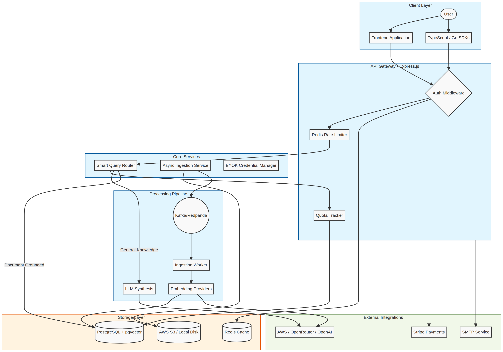
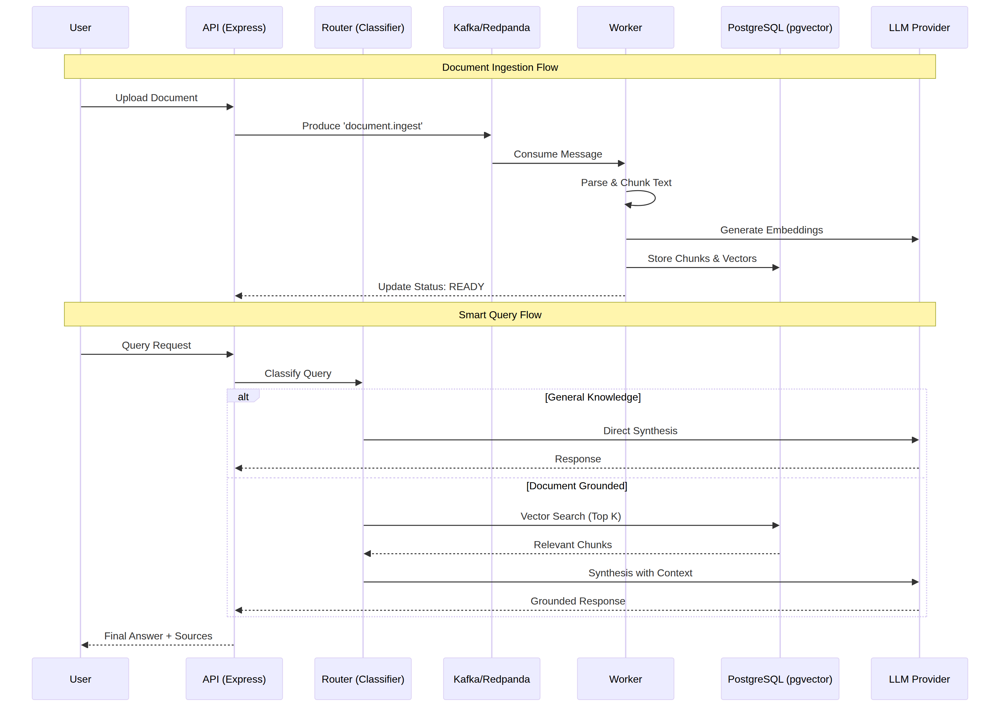

# FUGU — Routed RAG API Platform

A production-grade RAG (Retrieval-Augmented Generation) platform that intelligently routes queries to the most appropriate LLM based on document content, with pluggable embedding and synthesis providers, quota tracking, and multi-tenant organization support.

## Overview


FUGU combines:
- **Smart Query Routing**: Classifies queries into "general knowledge" (answered via LLM directly) or "document-grounded" (answered via RAG), routing each to the optimal LLM provider.
- **Multi-Provider Support**: Pluggable embedding (OpenAI, OpenRouter, Cohere, Gemini, Ollama, AWS Bedrock) and synthesis (OpenAI, OpenRouter, Cohere, Anthropic, Gemini) providers with both platform-paid and Bring-Your-Own-Key (BYOK) options.
- **Efficient Storage**: Documents chunked and embedded into a PostgreSQL vector store (dimension-keyed schema supporting all providers). S3-backed for new uploads (legacy local disk fallback for pre-migration documents).
- **Async Ingestion**: Kafka/Redpanda-based document processing queue with automatic retry and dead-letter handling.
- **Organization & Quotas**: Per-org subscription tiers (Free, Pro, Enterprise) with configurable monthly query limits, rate limiting (per-org for uploads, per-IP for auth), and file-size caps (50MB).
- **Secure Credentials**: BYOK provider keys encrypted in the database (AES-256-GCM, requires a 32-byte master key at deploy time).
- **Billing Integration**: Stripe payment processing with webhook support for subscription lifecycle events.

## Tech Stack

| Layer | Tech |
|-------|------|
| **API** | Express.js, TypeScript, Node.js 20+ |
| **Database** | PostgreSQL 15+ (vector embeddings via `vector` extension) |
| **Cache** | Redis (rate-limit tracking, session/token caching) |
| **Message Queue** | Redpanda (Kafka-compatible, async document ingestion) |
| **Embedding** | Ollama (default, free local), OpenAI, OpenRouter, Cohere, Gemini, AWS Bedrock |
| **LLM Synthesis** | OpenAI, OpenRouter, Cohere, Anthropic, Gemini |
| **Storage** | S3 (new uploads) + local disk (legacy fallback) |
| **Auth** | JWT (access + refresh tokens), Google OAuth, API keys per organization |
| **Payments** | Stripe |
| **Email** | SMTP (configurable, disabled by default in dev) |
| **Infra** | Docker Compose, GitHub Actions CI/CD, Terraform (IAM + S3 provisioning) |



## Project Structure

```
.
├── backend/                      # Node.js / Express backend
│   ├── src/
│   │   ├── config/               # Environment & constants
│   │   ├── controllers/          # Request handlers
│   │   ├── services/             # Business logic
│   │   ├── repositories/         # Data access layer
│   │   ├── routes/               # API route definitions
│   │   ├── middlewares/          # Auth, rate-limit, error handling
│   │   ├── types/                # TypeScript interfaces
│   │   └── server.ts             # App bootstrap
│   ├── migrations/               # Database migrations (run via `npm run migrate`)
│   ├── tests/                    # Unit & integration tests
│   └── package.json
├── frontend/                     # React/TypeScript single-page app (separate repo reference)
├── sdk-typescript/               # TypeScript SDK (published to npm as `fugu-sdk`)
├── sdk-go/                       # Go SDK (published to GitHub Modules)
├── infra/terraform/              # Infrastructure as Code
│   ├── providers.tf              # AWS provider config
│   ├── variables.tf              # Input variables
│   ├── iam.tf                    # IAM roles & policies
│   ├── s3.tf                     # S3 bucket for documents
│   └── ec2-attach.tf             # Attach IAM role to existing EC2 instance
├── .github/workflows/            # CI/CD pipelines
├── docker-compose.prod.yml       # Production multi-container setup
└── deployment/                   # Deployment scripts & secrets
    ├── deploy.sh                 # SSH/docker-compose refresh script
    ├── git-token.txt             # GitHub PAT (gitignored, invalid — needs renewal)
    └── terraform-aws-access-key.txt # Terraform admin IAM credentials (gitignored)
```



## Key Concepts

### Query Routing

Queries are classified into two paths:

1. **General Knowledge** — answered directly by the LLM, no document retrieval
2. **Document-Grounded** — queries search the document store, retrieve relevant chunks, and synthesize an answer grounded in those documents

Classification is performed by an **embedding-centroid classifier** (local, no LLM call needed): it embeds the query and checks if it's semantically close to any document centroids. This is cheap and keeps LLM calls to synthesis only.

### Embedding & Storage

- Documents are chunked (default 1200 chars for most providers, 350 chars for Ollama due to all-minilm's ~256-token context window).
- Each chunk is embedded into a dense vector (dimensions depend on provider: 1024 for Bedrock Titan v2, 384 for Ollama all-minilm, 1536 for OpenAI, etc.).
- Vectors are stored in PostgreSQL `document_chunks` table with **dimension-keyed columns** (`embedding_1024`, `embedding_1536`, etc.) so the platform isn't locked to one provider's output size.
- Chunk count is capped at **2000 per document** to prevent pathologically large uploads from looping the ingestion worker.

### BYOK vs. Platform-Paid

- **Embedding**: Platform-paid only (Ollama free local, or AWS Bedrock). Org's BYOK embedding credentials are ignored.
- **Synthesis (answer generation)**: BYOK-preferred (organization provides API key), falls back to platform default (OpenRouter).
- **Entity Extraction**: BYOK-only (skipped entirely if the org has no configured credential).

### Async Ingestion Pipeline

1. User uploads document via `POST /documents`
2. Multer middleware validates file (MIME/extension, ≤50MB) and stores to disk/S3
3. Document record created in `documents` table with status `PENDING`
4. Kafka message posted to `document.ingest` topic
5. Consumer worker picks up message:
   - Parses file (PDF, DOCX, XLSX, TXT, CSV, JSON via respective libraries)
   - Chunks text
   - Embeds chunks (via platform-paid provider)
   - Stores embeddings in `document_chunks`
   - Updates `documents.status` → `READY`
6. On error (3 retries exhausted), status → `FAILED`, message → DLQ

See `backend/src/services/document-ingestion.service.ts` for implementation.

### Rate Limiting

- **Upload/Query**: 60 requests/min per organization (or per IP if not authenticated), sliding window via Redis
- **Auth Endpoints**: 10 requests/min per IP

Configured in `backend/src/middlewares/rate-limit.middleware.ts`; if Redis is down, requests fail open (not blocked by the limiter).

### Quota System

Monthly query limits per subscription tier:
- **Free**: 1,000 queries/month
- **Pro**: 10,000 queries/month
- **Enterprise**: 100,000 queries/month

Enforced at query time. Each SDK response includes `quota: { used, limit, percent, warn }`.

## Getting Started

### Prerequisites

- Docker & Docker Compose (for multi-container local dev/prod)
- Node.js 20+ (for backend dev)
- PostgreSQL 15+ (can use docker image)
- Redis (can use docker image)
- Terraform (for AWS infra provisioning)

### Local Development

1. **Clone & install dependencies**
   ```bash
   cd backend
   npm install
   ```

2. **Set up environment**
   ```bash
   cp backend/.env.example backend/.env
   # Edit .env with local defaults (DATABASE_URL=postgresql://..., REDIS_URL=redis://...)
   ```

3. **Start services**
   ```bash
   docker-compose up -d postgres redis redpanda ollama
   ```

4. **Run migrations**
   ```bash
   npm run migrate
   ```

5. **Start backend in dev mode**
   ```bash
   npm run dev
   # Server runs on http://localhost:3001
   ```

6. **API documentation**
   - OpenAPI/Swagger: `GET http://localhost:3001/api/docs` (if implemented)
   - TypeScript SDK: `sdk-typescript/` (see SDK README for usage)

### Running Tests

```bash
npm test                    # All tests
npm run test:unit          # Unit tests only
npm run test:integration   # Integration tests (requires services running)
```

### Building for Production

```bash
npm run build
npm start
```

Docker image built by CI/CD pipeline in `.github/workflows/deploy.yml`; push triggers deployment to production EC2 via SSH + docker-compose refresh.

## Deployment

### Infrastructure

FUGU runs on a single AWS EC2 instance (eu-north-1, ~t3.medium) managed via Terraform:

1. **IAM Role** (`infra/terraform/iam.tf`): Allows backend container to invoke AWS Bedrock embeddings and S3 document reads/writes
2. **S3 Bucket** (`infra/terraform/s3.tf`): Stores new document uploads (versioning off, block all public access)
3. **EC2 Instance Profile** (`infra/terraform/ec2-attach.tf`): Attaches the IAM role; **existing instance is NOT recreated**, only the role is attached

Apply Terraform:
```bash
cd infra/terraform
terraform plan
terraform apply
# Verify in AWS Console that instance now shows the new IAM role attached
```

### CI/CD Pipeline

Push to `main` branch triggers `.github/workflows/deploy.yml`:
1. **Check**: linting, type checking, unit tests
2. **Build**: compile backend + frontend, build Docker images, push to Docker Hub
3. **Deploy**: SSH into EC2, pull latest images, restart containers via docker-compose

Pipeline takes ~9–10 minutes. Both frontend and backend go through the same pipeline; no fast-path exists.

**Note**: GitHub PAT in `deployment/git-token.txt` is currently invalid (HTTP 401). A new token must be generated and committed (or provided securely) to restore `gh` CLI access for deployment status checks.

### Environment Variables

**Required** (`production` environment):
- `DATABASE_URL` — PostgreSQL connection string
- `REDIS_URL` — Redis URL
- `JWT_ACCESS_SECRET`, `JWT_REFRESH_SECRET` — ≥32 bytes, unique per deployment
- `CREDENTIAL_ENCRYPTION_KEY` — 32-byte AES-256-GCM key (64 hex chars, or base64-encoded 32 bytes)
- `STRIPE_SECRET_KEY`, `STRIPE_WEBHOOK_SECRET`
- `SMTP_HOST`, `SMTP_PORT`, `SMTP_FROM`, `SMTP_USER`, `SMTP_PASS`

**Optional** (fallback values provided):
- `EMBEDDING_PROVIDER` — `'ollama'` (default, free) or `'bedrock'` (AWS Titan v2, paid)
- `OPENAI_API_KEY`, `OPENROUTER_API_KEY`, etc. — for BYOK synthesis fallback
- `AWS_REGION` — defaults to `'eu-north-1'`
- `S3_DOCUMENTS_BUCKET` — auto-provisioned by Terraform; populated at deploy time

**Fail-Fast Validation**: All env vars are validated at boot via Zod schema in `backend/src/config/env.ts`. Invalid/missing required vars cause an immediate, clear error message and exit code 1.

## API Overview

### Authentication

1. **Sign up**: `POST /auth/signup` → returns JWT access/refresh tokens
2. **Login**: `POST /auth/login`
3. **Refresh**: `POST /auth/refresh` (using refresh token)
4. **API Key**: Create an org API key via `POST /api-keys` → use key in `Authorization: Bearer <key>` header for SDK/CLI access

### Queries

```http
POST /queries
Content-Type: application/json
Authorization: Bearer <api_key_or_jwt>

{
  "query": "What does FUGU combine to answer questions?",
  "top_k": 5,
  "strategy": "auto"
}
```

Response includes:
- `answer` — synthesized answer
- `sources` — list of document chunks used
- `routing` — which path was taken ("general_knowledge" or "document_grounded")
- `quota` — current org usage

### Documents

```http
POST /documents
Content-Type: multipart/form-data
Authorization: Bearer <api_key_or_jwt>

(file upload)
```

Returns document metadata with status `PENDING` (ingestion in progress).

```http
GET /documents/:id
Authorization: Bearer <api_key_or_jwt>
```

Check document status. When ingestion completes, status becomes `READY`.

### Credentials

```http
POST /credentials
Authorization: Bearer <jwt>
Content-Type: application/json

{
  "provider": "openai",
  "apiKey": "sk-..."
}
```

Stores encrypted BYOK credential for the org. Used by synthesis/entity extraction if configured.

## SDKs

### TypeScript / JavaScript

```bash
npm install fugu-sdk
```

```typescript
import { FuguClient } from 'fugu-sdk';

const client = new FuguClient({
  apiKey: 'fugu_sk_...',
  baseUrl: 'https://fugu-routes.com/api',
});

const result = await client.query.execute('What does FUGU do?');
console.log(result.answer);
```

See `sdk-typescript/README.md` for full API.

### Go

```bash
go get github.com/dogukandemirci-software-engineer/fugu-ragrouting/sdk-go
```

```go
package main

import (
  "context"
  fugu "github.com/dogukandemirci-software-engineer/fugu-ragrouting/sdk-go"
)

func main() {
  client := fugu.NewClient("fugu_sk_...", fugu.WithBaseURL("https://fugu-routes.com/api"))
  resp, err := client.Query.Execute(context.Background(), "What does FUGU do?", fugu.QueryOptions{})
  // ...
}
```

See `sdk-go/README.md` for full API.

## Security & Best Practices

### Data Protection

- **Encryption at Rest**: BYOK provider credentials are encrypted with AES-256-GCM before storage. The master key must never be logged or exposed; it's loaded from `CREDENTIAL_ENCRYPTION_KEY` env var at boot.
- **Encryption in Transit**: All API endpoints use HTTPS in production (TLS termination at the load balancer, EC2 runs plain HTTP internally).
- **JWT Tokens**: Signed with strong secrets (≥32 bytes), short lifetime for access (default 15m), refresh tokens valid for 7 days.
- **API Keys**: Scoped per organization, opaque tokens stored hashed in the database.

### Authentication & Authorization

- **Organization Isolation**: Every data operation is scoped to the requesting org (enforced via JWT claims or API key org_id).
- **Rate Limiting**: Sliding-window Redis-based limiter prevents brute-force and abuse (60 req/min per org for uploads/queries, 10 req/min per IP for auth).
- **No Plaintext Secrets**: Never log API keys, tokens, or credentials. Sanitize error messages.

### BYOK Credential Handling

- Credentials are encrypted before DB storage; decrypted only when used (in-memory, never logged).
- If `CREDENTIAL_ENCRYPTION_KEY` is lost, all stored credentials become unrecoverable; back it up to a secure secret store.
- Credential validation is deferred (attempted at use time), so invalid/revoked credentials are caught during synthesis/entity extraction, not at save time.

### Input Validation

- **Query Length**: Capped at 4,000 characters (DTO validation via class-validator).
- **File Upload**: Size ≤50MB, MIME/extension allowlist (PDF, DOCX, XLSX, TXT, CSV, JSON).
- **Chunk Size**: Documents chunked to 350–1200 chars (depends on provider) to stay within embedding model context windows.
- **Chunk Count**: Capped at 2,000 per document to prevent runaway ingestion.

### Error Handling

- **No Stack Traces in Response**: Production responses never include stack traces or internal error details.
- **DLQ for Failed Ingestions**: Documents that fail ingestion after 3 retries are moved to a dead-letter queue; manual investigation required.
- **Graceful Degradation**: If Redis is unavailable, rate limiting fails open (requests are not blocked); if Kafka is down, ingestion queue is disabled and uploads fail fast with a clear message.

## Monitoring & Debugging

### Application Logs

Backend logs to stdout/stderr via Winston logger (configurable via `LOG_LEVEL` env var):

```bash
docker logs fugu-backend
docker logs fugu-backend --since 15m --follow
```

Key log patterns:
- `Document ingestion failed` — document failed to ingest, check DLQ
- `Embedding error`, `input length exceeds context` — document chunk too large, or embedding provider quota exhausted
- `Gemini embeddings require a BYOK gemini credential` — org has no Gemini credential but platform doesn't support Bedrock (legacy Ollama fallback)

### Database Health

```bash
# SSH into EC2, then:
docker exec fugu-postgres psql -U postgres -d fugu -c "SELECT COUNT(*) FROM documents WHERE status='PENDING';"
```

### Message Queue Health

```bash
docker exec fugu-redpanda rpk topic describe document.ingest
docker exec fugu-redpanda rpk group describe ingestion-workers
# LAG should be 0 if the consumer is keeping up
```

### Redis Cache

```bash
docker exec fugu-redis redis-cli
> INFO stats
> KEYS rl:* | head -20  # Rate-limit keys
```

## Troubleshooting

### Documents Stuck in "PENDING" Status

**Cause**: Ingestion worker crashed or embedding provider is throttled/unavailable.

**Steps**:
1. Check backend logs: `docker logs fugu-backend | grep -iE 'ingest|embed|error'`
2. Check message queue: `docker exec fugu-redpanda rpk group describe ingestion-workers` (LAG should be ≤ 5, should trend down)
3. If provider throttled (Bedrock new-account quota): switch to local Ollama (`EMBEDDING_PROVIDER=ollama`)
4. Retry document ingestion from the dashboard, or re-upload if too broken

### Query Timeouts

**Cause**: LLM synthesis provider is slow or hitting a rate limit.

**Steps**:
1. Check `LLM_SYNTHESIS_TIMEOUT_MS` (default 20s)
2. If BYOK synthesis fails, platform falls back to OpenRouter default; verify BYOK credential is valid
3. If OpenRouter is throttled, upgrade org's plan to reserve quota

### High Memory Usage

**Cause**: Large document ingestion, embedding cache bloat, or connection pool leaks.

**Steps**:
1. Reduce `EMBEDDING_CACHE_SIZE` (default 1000) — trade memory for re-embedding cost
2. Check connection pool leaks in `backend/src/repositories/*`
3. Monitor: `docker stats fugu-backend`

### Rate Limiting False Positives

**Cause**: Redis key TTL misconfiguration or clock skew between backend + Redis.

**Steps**:
1. Verify Redis is running: `docker exec fugu-redis redis-cli ping`
2. Check backend logs for rate-limiter errors (usually `MOVED` or connection timeouts)
3. If Redis persistent (many retries), restart it: `docker restart fugu-redis`

## Contributing

1. Create a feature branch from `main`
2. Run tests: `npm test`
3. Lint: `npm run lint`
4. Commit with clear message
5. Open PR; CI/CD pipeline runs automatically
6. Once approved & green, merge to `main` → triggers deploy

## License

Proprietary. See LICENSE file for details.

## Contact & Support

- **Dashboard**: https://fugu-routes.com (old production ,not in prod now), http://localhost:5173 (local dev)
